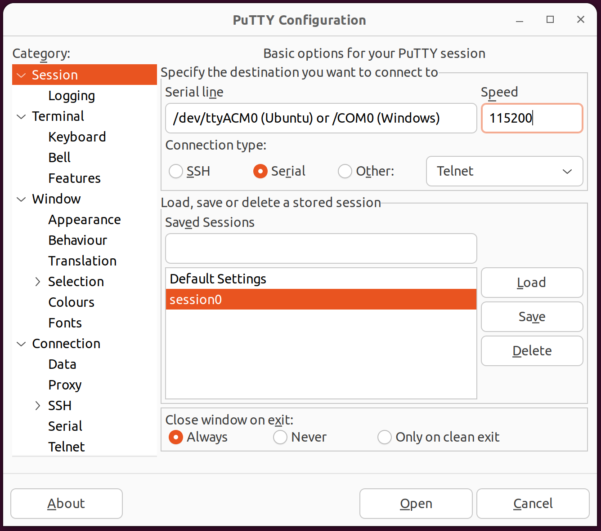
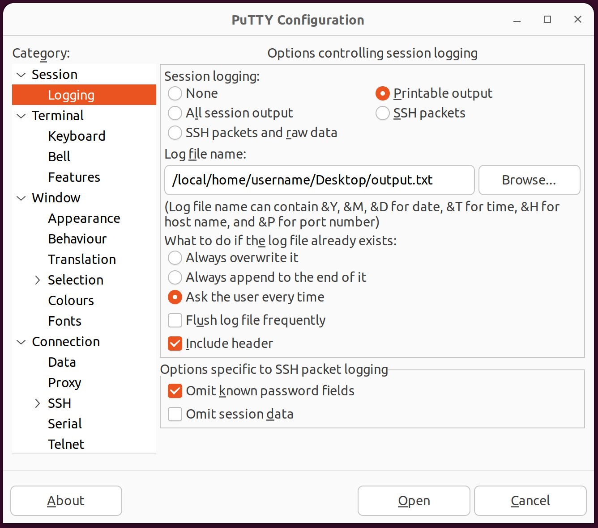

# STM32 dataloggers example 

In this repository : 

* C code examples on how to collect data from sensors and print the values through uart 
* Examples of complete NanoEdgeAI project (datalogger + libraries)

Currently, 8 development board and 15 sensors are available


## Contents

- [NanoEdgeAI - Datalogging](#nanoedgeai-dataogging)
    - [Installation](#installation)
    - [Hardware](#hardware)
      - [Development boards](#development-boards)
      - [Sensors](#sensors)
      - [Wiring](#wiring)
    - [Software](#software)
      - [Prerequisites](#prerequisites)
      - [Macros definitions](#macros-definitions)
      - [General marcos](#general-macros)
      - [Sensors specificities](#sensors-specificities)
        - [Accelerometer & gyroscope](#accelerometer-&-gyroscope)
        - [Time of flight](#time-of-flight)
      - [In all projects](#in-all-projects)
      - [Prohibited](#prohibited)
    - [Data acquisition](#data-acquisition)
    - [NanoEdge AI library integration](#nanoedge-ai-library-integration)
    - [Running and flashing the application on the board](#running-and-flashing-the-application-on-the-board)


## Installation

Open a terminal and run the following command:

```shell
git clone https://github.com/stm32-hotspot/stm32ai-nanoedge-datalogger --recurse-submodules
```

This command allows you to download the NanoEdgeAI - Datalogger repository and all the needed git submodules which are STMicroelectronics Github repositories.

Once you've run this command, open your "STM32CubeIDE" -> "File" -> "Open Projects from File System" and select the project(s) you want to use.

## Hardware

These code examples allow to quickly create data loggers based on the following hardware:

### Development boards

- B-U585I-IOT02A : https://www.st.com/en/evaluation-tools/b-u585i-iot02a.html
- NUCLEO-C031C6 : https://www.st.com/en/evaluation-tools/nucleo-c031c6.html
- NUCLEO-F401RE : https://www.st.com/en/evaluation-tools/nucleo-f401re.html
- NUCLEO-F411RE : https://www.st.com/en/evaluation-tools/nucleo-f411re.html
- NUCLEO-L476RG : https://www.st.com/en/evaluation-tools/nucleo-l476rg.html
- NUCLEO-U575ZI-Q : https://www.st.com/en/evaluation-tools/nucleo-u575zi-q.html
- STEVAL-PROTEUS1 : https://www.st.com/en/evaluation-tools/steval-proteus1.html
- STEVAL-STWINKT1B : https://www.st.com/en/evaluation-tools/steval-stwinkt1b.html
- STEVAL-STWINBX1 : https://www.st.com/en/evaluation-tools/steval-stwinbx1.html
- STM32L496G-DISCO : https://www.st.com/en/evaluation-tools/32l496gdiscovery.html
- STM32L562E-DK : https://www.st.com/en/evaluation-tools/stm32l562e-dk.html

### Sensors

- ANALOG sensor
- HTS221 : https://www.st.com/en/mems-and-sensors/hts221.html
- IIS2DLPC : https://www.st.com/en/mems-and-sensors/iis2dlpc.html
- IIS2MDC : https://www.st.com/en/mems-and-sensors/iis2mdc.html
- IIS3DWB : https://www.st.com/en/mems-and-sensors/iis3dwb.html
- IKA01A1 : https://www.st.com/en/ecosystems/x-nucleo-ika01a1.html
- IMP34DT05 : https://www.st.com/en/mems-and-sensors/imp34dt05.html
- ISM330DHCX : https://www.st.com/en/mems-and-sensors/ism330dhcx.html
- ISM330IS : https://www.st.com/en/mems-and-sensors/ism330is.html
- LIS2DW12 : https://www.st.com/en/mems-and-sensors/lis2dw12.html
- LIS2MDL : https://www.st.com/en/mems-and-sensors/lis2mdl.html
- LPS22HH : https://www.st.com/en/mems-and-sensors/lps22hh.html
- LSM6DSO : https://www.st.com/en/mems-and-sensors/lsm6dso.html
- MP23ABS1 : https://www.st.com/en/mems-and-sensors/mp23abs1.html
- VL53L5CX : https://www.st.com/en/imaging-and-photonics-solutions/vl53l5cx.html

### Wiring

Here are the wire connections between the development boards and the sensors. We use ADC, SPI and I2C.

| Boards / Sensors | **B-U585I-IOT02A**                                           | NUCLEO-C031C6                                                | **NUCLEO-F401RE / F411RE / L476RG**                          | NUCLEO-U575ZI-Q      | **STEVAL-PROTEUS1**                                          | STEVAL-STWINBX1                                              | **STEVAL-STWINKT1B**                                         | **STM32L496G-DISCO**                        | **STM32L562E-DK**                                          |
| :--------------: | :----------------------------------------------------------- | ------------------------------------------------------------ | :----------------------------------------------------------- | -------------------- | :----------------------------------------------------------- | ------------------------------------------------------------ | :----------------------------------------------------------- | :------------------------------------------ | :--------------------------------------------------------- |
|    **ANALOG**    | *1) ADC1_IN1 <> PC0*                                         |                                                              |                                                              |                      |                                                              |                                                              |                                                              |                                             |                                                            |
|    **HTS221**    |                                                              |                                                              | *1) I2C1 - SCL <> PB8 // SDA <> PB9<br />2) EXTI10 <> PA10*  |                      |                                                              |                                                              |                                                              |                                             |                                                            |
|   **IIS2MDC**    | *1) I2C2 - SCL <> PH4 // SDA <> PH5 <br />2) EXTI10 <> PD10* |                                                              |                                                              |                      |                                                              | *1) I2C2 - SCL <> PH4 // SDA <> PF0 <br />2) EXTI9 <> PF9*   | *1) I2C2 - SCL <> PF0 // SDA <> PF1 <br />2) EXTI9 <> PF9*   |                                             |                                                            |
|   **IIS3DWB**    |                                                              |                                                              |                                                              |                      | *1) SPI1 - SCK <>  PA5 // MISO <> PA6 // MOSI <> PB5 <br />2) EXTI3 <> PE3* | *1) SPI2 - SCK <>  PI1 // MISO <> PD3 // MOSI <> PI3 <br />2) EXTI15 <> PF15* |                                                              |                                             |                                                            |
|   **IKA01A1**    |                                                              | *1) ADC1_IN4 <> PA4*<br />                                   | *1) ADC1_IN4 <> PA4*<br />*! Not yet for L476RG !*           | *1) ADC1_IN4 <> PC3* |                                                              |                                                              |                                                              |                                             |                                                            |
|  **IMP34DT05**   |                                                              |                                                              |                                                              |                      |                                                              |                                                              |                                                              | *1) DFSDM1 - DATIN3 <> PC7 // CKOUT <> PC2* |                                                            |
|  **ISM330DHCX**  | *1) I2C2 - SCL <> PH4 // SDA <> PH5 <br />2) EXTI11 <> PE11* |                                                              |                                                              |                      | *1) SPI1 - SCK <> PA5 // MISO <> PA6 // MOSI <> PB5 <br />2) EXTI4 <> PE4* | *1) SPI2 - SCK <>  PI1 // MISO <> PD3 // MOSI <> PI3 <br />2) EXTI8 <> PB8* | *1) SPI3 - SCK <> PB3 // MISO <> PB4 // MOSI <> PB5 <br />2) EXTI8 <> PE8* |                                             |                                                            |
|  **ISM330ISN**   |                                                              |                                                              | *1) I2C1 - SCL <> PB8 // SDA <> PB9 <br />2) EXTI0 <> PC0*   |                      |                                                              |                                                              |                                                              |                                             |                                                            |
|   **LIS2DW12**   |                                                              | *1) I2C1 - SCL <> PB8 // SDA <> PB9 <br />2) EXTI1 <> PB1*   | *1) I2C1 - SCL <> PB8 // SDA <> PB9 <br />2) EXTI0 <> PB0*   |                      |                                                              |                                                              |                                                              |                                             |                                                            |
|   **LIS2MDL**    |                                                              | *1) I2C1 - SCL <> PB8 // SDA <> PB9 <br />2) EXTI4 <> PA4*   | *1) I2C1 - SCL <> PB8 // SDA <> PB9 <br />2) EXTI4 <> PA4*   |                      |                                                              |                                                              |                                                              |                                             |                                                            |
|   **LPS22HH**    |                                                              |                                                              | *1) I2C1 - SCL <> PB8 // SDA <> PB9 <br />2) EXTI10 <> PB10* |                      |                                                              |                                                              |                                                              |                                             |                                                            |
|   **LSM6DSO**    |                                                              | *1) I2C1 - SCL <> PB8 // SDA <> PB9 <br />2) EXTI10 <> PB10* | *1) I2C1 - SCL <> PB8 // SDA <> PB9 <br />2) EXTI5 <> PB5*   |                      |                                                              |                                                              |                                                              |                                             | *1) I2C1 - SCL <> PB6 // SDA <> PB7 <br />2) EXTI3 <> PF3* |
|   **MP23ABS1**   |                                                              |                                                              |                                                              |                      |                                                              |                                                              | *1) ADC1_IN2 <> PC1*                                         |                                             |                                                            |
|   **VL53L5CX**   | *1) I2C2 - SCL <> PH4 // SDA <> PH5 <br />2) EXTI5 <> PG5*   |                                                              |                                                              |                      |                                                              |                                                              |                                                              |                                             |                                                            |

*PS : EXTI = External Interrupt pin.*

## Software

### Prerequisites

These STM32Cube projects has been developped and tested under STM32CubeIDE v1.10.1. It requires installing following softwares and packages:

- The STM32CubeIDE software: [Download](https://www.st.com/en/development-tools/stm32cubeide.html#get-software)

To create your own NanoEdge AI project, following softwares are also required:

- The NanoEdge AI Studio software: [Download](https://www.st.com/en/development-tools/nanoedgeaistudio.html#get-software)
- A serial port terminal, for example PuTTY: [Download](https://www.chiark.greenend.org.uk/~sgtatham/putty/latest.html)

### Macros definitions

Once your project opened with STM32CubeIDE, you can modify the source code.

#### General macros

Here are the macros you can modify in all the different projects :

The "SAMPLES" definition :

```c
#define SAMPLES           2048    /* Should be between 16 & 4096 */
```

For "SAMPLES" please set samples between 16 & 4096 because, get less than 16 values in a buffer has not really sense in term of machine learning & get more than 4096 is risky regarding the micro controller RAM memory.

The "ODR" (output data rate) definition, depending on your sensor. Here are some examples :

```c
#define ANALOG_ODR        1000    /* Should be between 1 & 100 kHz */
```

```c
#define MAGNETOMETER_ODR  IIS2MDC_ODR_100Hz   /* Shoud be between IIS2MDC_ODR_10Hz and IIS2MDC_ODR_100Hz */
```

```c
#define HUMIDITY_ODR  HTS221_ODR_12Hz5  /* Shoud be between HTS221_ODR_1Hz and HTS221_ODR_12Hz5 */
```

```c
#define PRESSURE_ODR  LPS22HH_100_Hz  /* Shoud be between LPS22HH_1_Hz and LPS22HH_200_Hz */
```

For the output data rate definition please make attention to respect what is written in the comment. You can't set the value of your choice, it won't work.

The "MODE" selection :

```c
#define NEAI_MODE         0       /* 0: Datalogger mode, 1: NEAI functions mode */
```

The mode selection allows you to switch between the "Datalogger mode" & the "NEAI mode". In data logging mode the sensor data are written to the serial in a buffer whereas in NEAI mode there will be a learning phase then a detection phase.

If you choose the NEAI mode, you can set the number of learnings you want to perform.

```c
#define NEAI_LEARN_NB   100     /* Number of buffers to be learn by the NEAI library */
```

Normally the number of learnings is given by NEAI Studio when you create your own library.

#### Sensors specificities

##### Accelerometer & gyroscope

Depending on your sensor you can select either accelerometer either gyroscope data type setting the following macro :

```c
#define SENSOR_TYPE                   ACCELEROMETER             /* Here we define the data type we're going to collect */
```

Once you've set the previous macro, you can define the accelerometer / gyroscope output data rate with :

```c
#define ACCELEROMETER_ODR           ISM330DHCX_XL_ODR_1666Hz  /* Shoud be between ISM330DHCX_XL_ODR_12Hz5 and ISM330DHCX_XL_ODR_6667Hz */
```

```c
#define GYROSCOPE_ODR               ISM330DHCX_GY_ODR_1666Hz  /* Shoud be between ISM330DHCX_GY_ODR_12Hz5 and ISM330DHCX_GY_ODR_6667Hz */
```

And also the range :

```c
#define ACCELEROMETER_FS            ISM330DHCX_2g             /* Should be between ISM330DHCX_2g and ISM330DHCX_8g */
```

```c
#define GYROSCOPE_FS                ISM330DHCX_2000dps        /* Should be between ISM330DHCX_125dps and ISM330DHCX_4000dps */
```

Please make attention to set "possible" values for these macro. Look at the comment or take a look at the sensor datasheet.

##### Time of flight

For the TOF sensor, the samples if defined by the MATRIX_RESOLUTION & the SUCCESSIVE_MATRIX number. For optimal use, I suggest to let the MATRIX_RESOLUTION to 64 which is the biggest resolution for the VL53L5CX. But you have to define the SUCCESSIVE_MATRIX you want depending on the phenomenom you want to observe :

```c
#define MATRIX_RESOLUTION   64                                    /* 16 if resolution is VL53L5CX_RESOLUTION_4X4 else, 64 if VL53L5CX_RESOLUTION_8X8 */
#define SUCCESSIVE_MATRIX   8                                     /* The number of successive matrix to get in the neai buffer */
  #define SAMPLES           MATRIX_RESOLUTION * SUCCESSIVE_MATRIX /* In this specific application, the samples is defined by the resolution * successive_matrix */
```

The TOF data rate is defined using the following macro :

```c
#define DISTANCE_ODR      15                                    /* Should be between 1 -> 60Hz for VL53L5CX_RESOLUTION_4X4 and 1 -> 15Hz for VL53L5CX_RESOLUTION_8X8 */
```

Make attention that depending on the MATRIX_RESOLUTION, the data can't be set at the same values.

#### In all projects

You've the possibility to set the AXIS number. You can set 1, 2 or 3 axes but if you modify this macro **you have to modify the rest of the code by yourself**.

```c
#define AXIS              3                   /* Axis should be defined between 1 and 3 */
```

#### Prohibited

For accelerometer / gyroscope sensors do not modify the following macros !

```c
#define MAX_FIFO_SIZE                   256                       /* The maximum number of data we can get in the FIFO is 512 but here we define max to 256 for our need */
#define FIFO_FULL                       512                       /* FIFO full size */
#define FIFO_WORD                       7                         /* FIFO word size composed of 1 byte which is identification tag & 6 bytes of fixed data */
```

### Data acquisition

Here are 3 different ways to collect your data :

1. **Putty**

   Putty is a free Implementation of SSH and Telnet for Windows and Unix platforms.

   - Download link for Windows : https://www.putty.org/


   - For Unix, you can run the following command :

     ```bash
     sudo apt-get install putty
     ```

   Putty is really simple to use, open it then, in "Session > Login", check "Serial" :

   

   In this window, you just have to 

   - Set the good COM port (Windows) or ttyACM (Unix) depending on your OS.
   - Set the speed to 115200.

   Once you've done this step, **you need to uncheck the following parameter** :

   

   In "Session > Logging", you have to unchecked "Flush log file frequently". If you left this box checked, you won't reach the maximum data rate.

   As we can see on the picture, if you want to get the data in an output file, you need to check "Printable output" then define the output file path.

2. **Python**

   Collecting the data using python should be done using a script like this :

   ```python
   import serial, os
   
   def get_usb_data():
      while 1:
         while (ser.inWaiting() > 0):
            data=ser.read(ser.inWaiting()).decode()
            f = open('output_file.txt','a') 
            data=str(data)
            f.write(data)
   
   if __name__ == "__main__":
      ser = serial.Serial('your_com_port', 0, timeout=0)
      if os.path.exists("output_file.txt"):
         os.remove("output_file.txt")
      get_usb_data()
   ```

3. **BASH**

   If you want to use BASH to get your data, you can run the following commands :

   ```bash
   stty -F your_com_port 115200 raw -clocal -echo icrnl
   cat your_com_port
   ```

   Where "*your_com_port*" is something like /dev/ttyACMXX (Unix) or COMXX (Windows).

   In Unix system you just have to open a terminal to run this command but in Windows, you should install "Git for Windows" which allows you to have a BASH emulation to run the command line. Download link : https://gitforwindows.org/

### NanoEdge AI library integration

The NanoEdgeAI library is composed of 2 files to include in the STM32Cube project:

- The libneai.a file, to place in Core/Src folder.
- The NanoEdgeAI.h header file, to place in the Core/Inc folder.

To add the library to the compilation string, it is necessary to edit project settings, by going in Project -> Properties -> C/C++ Build -> Settings -> Tool Settings -> MCU GCC Linker -> Libraries. 

Here, it is required to add:

- "neai" in the "Libraries (-l)" section.
- "${workspace_loc:/${ProjName}/Core/Src}" in the "Library search path (-L)" section.

### Running and flashing the application on the board

Connect your development board (by the STLK USB port) to your computer. Compile and flash the code using STM32CubeIDE.
